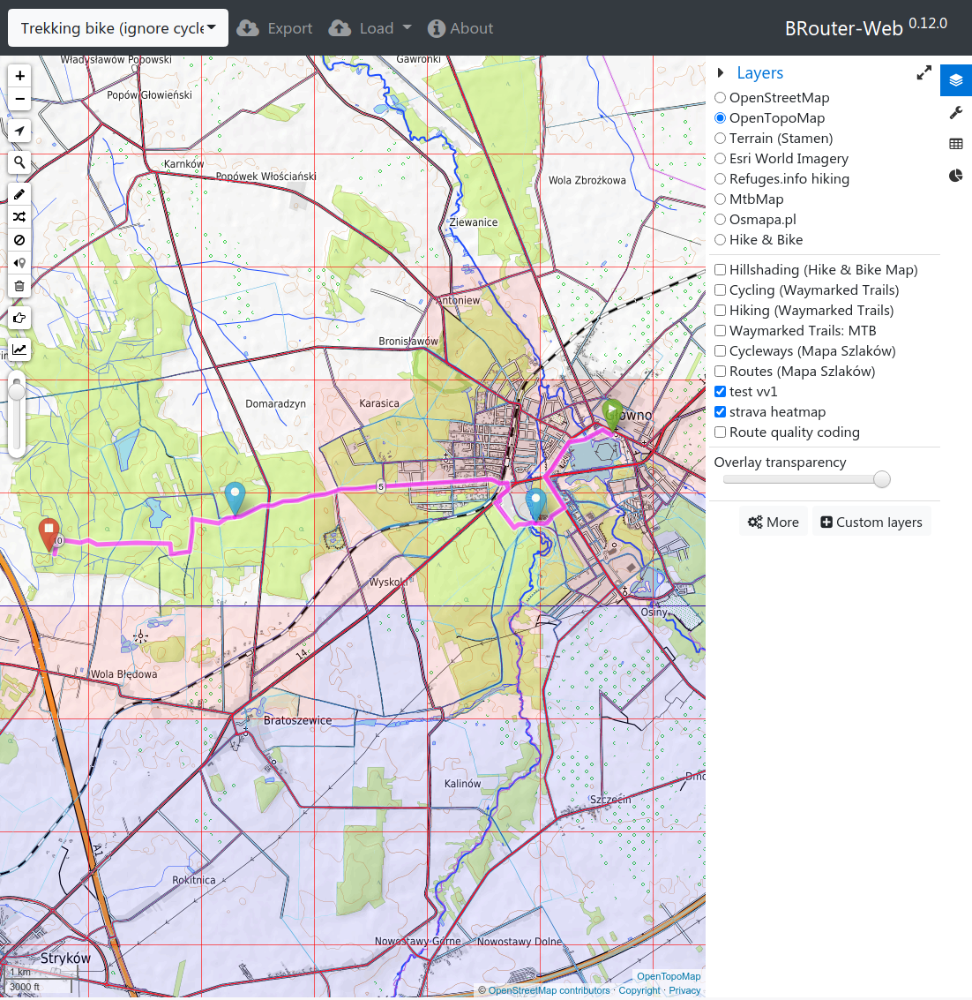

# VeloViewer Explorer Overlay tile-server
Generic overlay for VeloViewer Explorer squares

## Explorer info:
- https://blog.veloviewer.com/veloviewer-explorer-score-and-max-square/
- https://rideeverytile.com/
- https://www.strava.com/clubs/279168

## BRouter example

## TODO
- [ ] zoom level < 14
- [ ] color setup support (maybe including transparency option)
- [x] frames
- [ ] auto-refresh of squares cache, with proper locking
- [ ] cache (at least for z=14+ and later for z=11..13)
- [ ] different color for clusters ("inside" squares)

